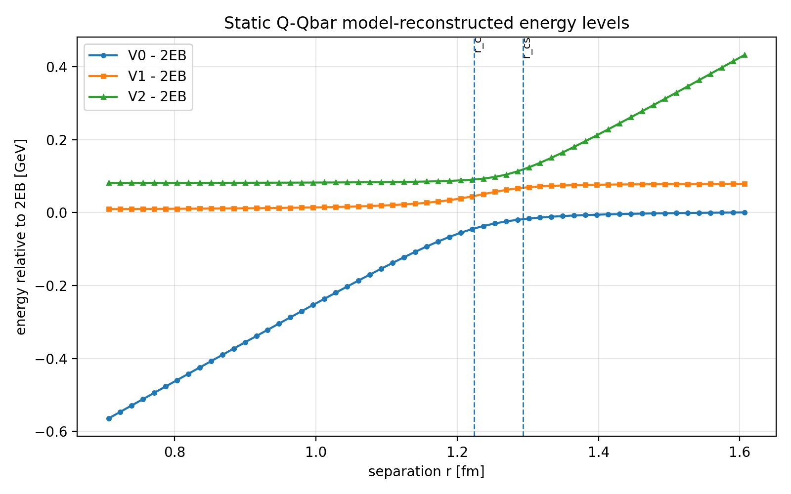
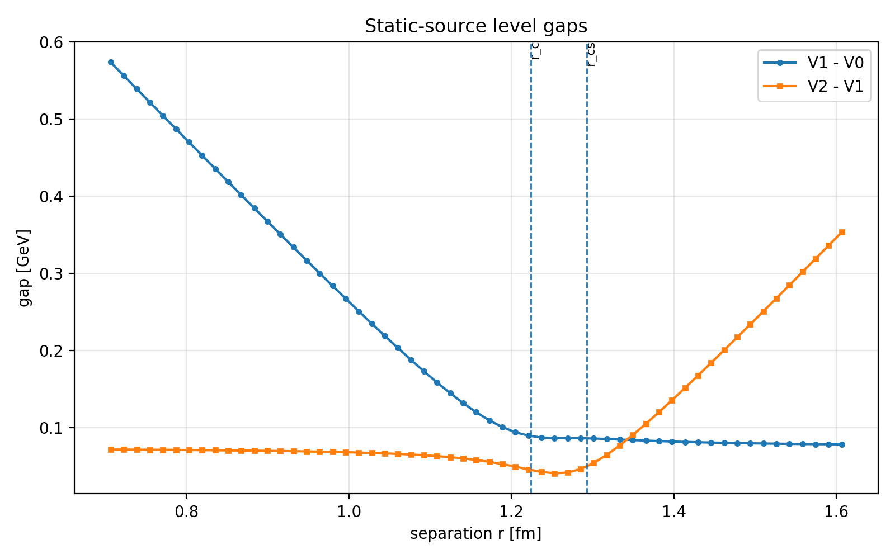
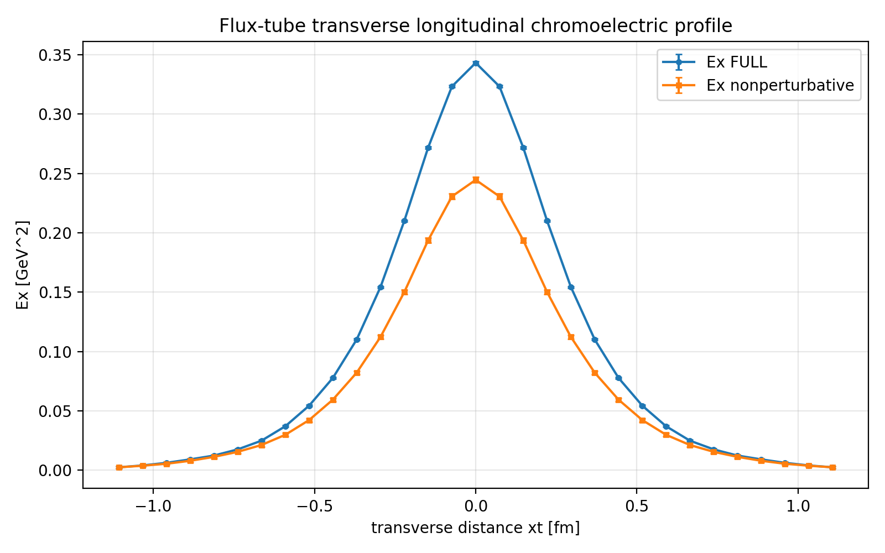
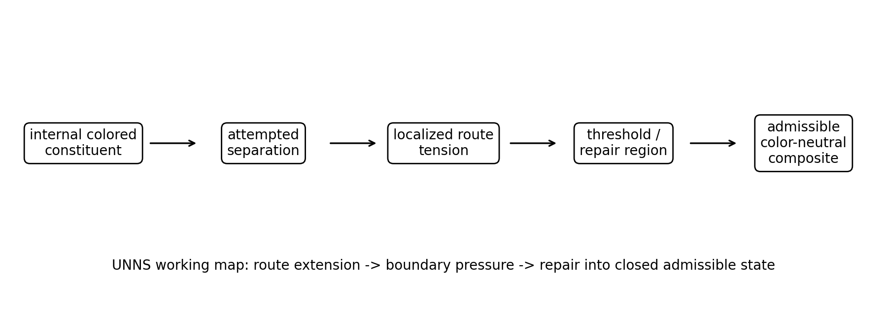

# First Confinement Diagnostic

This diagnostic is generated from the current UNNS + color confinement data pack.
It is a first analysis pass, not a claim that UNNS derives QCD confinement.

## 1. Data status

### Static-source energy levels

- Input: `C:\Users\igorc\Desktop\UNNS_SUBSTRATE(desktop)\TRANSFER\Bulk_2\REGIME_SYNTHESIS\Color confinement\color_confinement_data_seed_v0_1_1_provenance\data\01_core_static_potential\bulava2019_model_reconstructed_pointwise_E_levels.csv`
- Rows: 57
- Separation range: 0.70686 to 1.6065 fm
- Data status: MODEL_RECONSTRUCTION_FROM_REPORTED_PARAMETERS_NOT_RAW_DATA

### String-breaking thresholds

- r_c (light_static_light_threshold): r = 1.224 fm +/- 0.015 fm; nearest reconstructed r = 1.22094 fm; gap01 = 0.0897 GeV; gap12 = 0.0459369 GeV.
- r_cs (strange_static_strange_threshold): r = 1.293 fm +/- 0.016 fm; nearest reconstructed r = 1.2852 fm; gap01 = 0.0864175 GeV; gap12 = 0.0463905 GeV.

### Flux-tube pointwise profile

- Input: `C:\Users\igorc\Desktop\UNNS_SUBSTRATE(desktop)\TRANSFER\Bulk_2\REGIME_SYNTHESIS\Color confinement\color_confinement_data_seed_v0_1_1_provenance\data\03_core_flux_tube_profiles\baker2024_pointwise_Ex_FULL_NP_beta7_158_d10a_0_738fm.csv`
- Rows: 31
- Transverse range: -1.10746 to 1.10746 fm
- Source separation: 0.738309 fm
- Data status: AUTHOR_ANCILLARY_POINTWISE_DATA
- Peak Ex FULL: 0.343135 GeV^2
- Peak Ex NP: 0.244566 GeV^2
- Estimated NP FWHM: 0.551469 fm

## 2. Diagnostic figures

### Static energy levels



### Static energy gaps



### Flux-tube profile



### UNNS confinement sequence



## 3. UNNS working map

The current evidence supports the following provisional mapping:

```
quark separation r
-> route-extension coordinate

static spectrum V0(r), V1(r), V2(r)
-> boundary-pressure / route-tension spectrum

string-breaking threshold
-> repair-threshold marker

two-meson threshold / screened channel
-> repaired admissible composite channel

flux-tube transverse profile Ex(xt)
-> localized route geometry

absence of free color in the ordinary external spectrum
-> non-externalizable internal coordinate
```

## 4. Interpretation

The static-source diagnostic supplies a controlled route-extension axis: increasing separation r probes how the static-source spectrum reorganizes near reported string-breaking thresholds. The flux-tube profile supplies a direct geometry of route localization: the chromoelectric field is concentrated around the line connecting the static sources rather than dispersing freely.

For the UNNS investigation, this supports a structural reading of color confinement as admissibility-by-closure: internal colored constituents are not externally admissible as isolated objects; attempted separation is carried by a tensioned route and repaired into color-neutral composite channels.

## 5. What is not yet proven

- The Bulava V0,V1,V2 table used here is model-reconstructed from reported Hamiltonian parameters, not raw measured GEVP point data.
- Only one Baker flux-tube profile is included in this first pointwise pass.
- This diagnostic does not derive QCD confinement from UNNS.
- This diagnostic does not replace lattice-QCD analysis.

## 6. Next missing data

```
1. Author or digitized measured V0(r), V1(r), V2(r) points from Bulava figures/tables.
2. All Baker ancillary flux-tube profiles across separations and beta values.
3. A small comparison table linking threshold positions to gap structure and flux-tube width.
4. Only then: a UNNS boundary-pressure proxy fitted across the acquired pointwise data.
```
