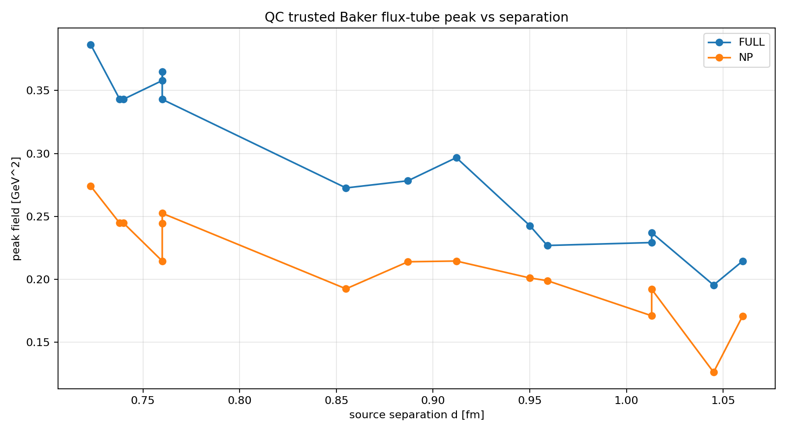
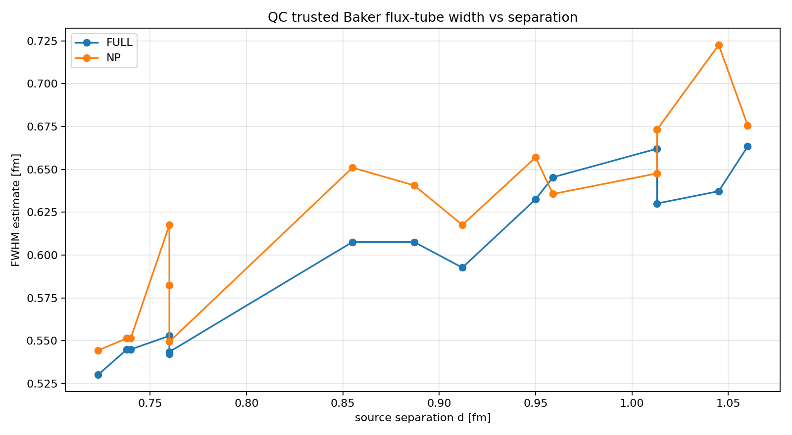
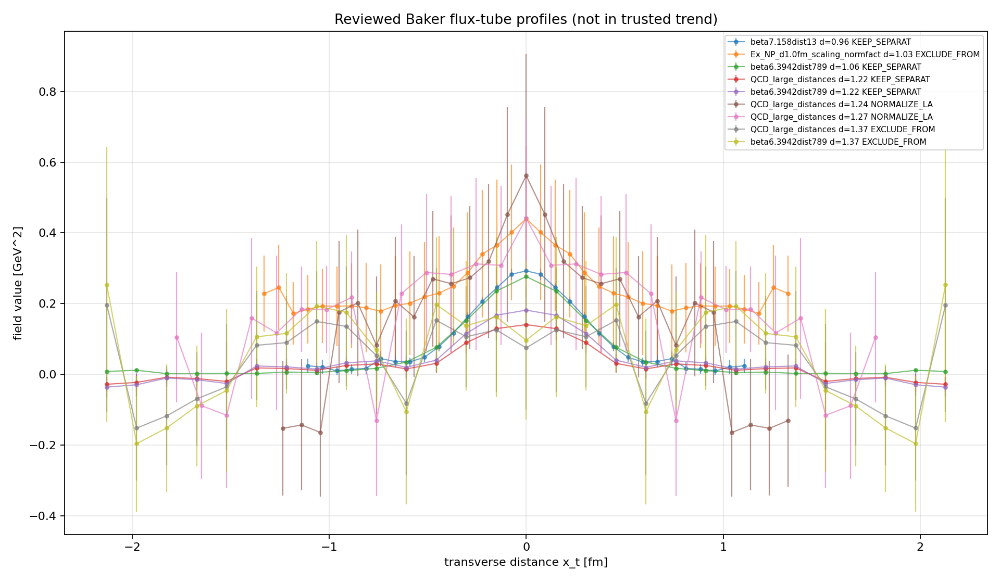
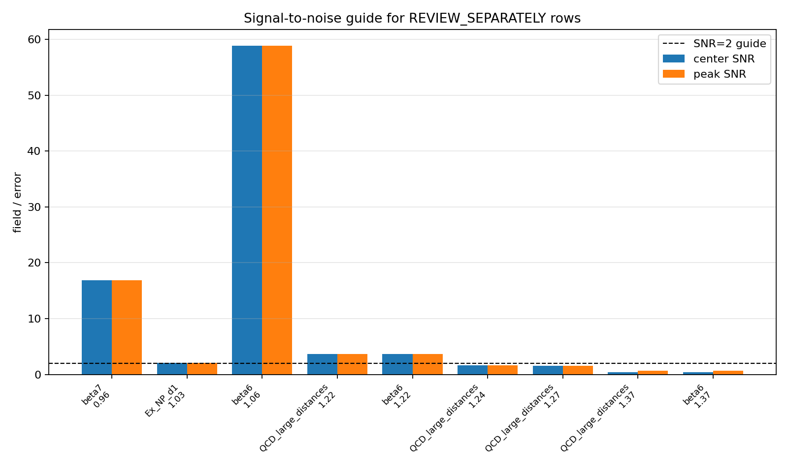
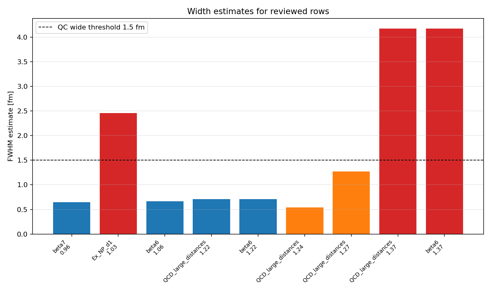

# UNNS Color Confinement - Flux-Tube Extension Report

**Subtitle:** Route localization across increasing static-source separation  
**Milestone:** Third formal report in the UNNS + color confinement investigation  
**Status:** Formal interpretation report based on Baker flux-tube extension, QC, and review-separately decisions  

---

## Executive result

The Baker flux-tube extension gives a controlled separation-dependent dataset for the UNNS interpretation of color confinement as **localized route geometry**. After quality control, the main interpretable trend is restricted to ordinary **FULL** and **NP** transverse chromoelectric profiles over:

```
d = 0.723-1.060 fm
accepted rows = 30
components = FULL and NP
```

Within this trusted set, increasing source separation is associated with a **decrease in central/peak field intensity** and a **moderate increase in transverse width**. This supports a cautious UNNS reading:

```
source separation d
-> route-extension coordinate

E_x(x_t; d)
-> localized route geometry

peak decrease + width increase
-> route redistribution under extension
```

This report does **not** claim a derived QCD confinement law. It formalizes a data-grounded structural mapping: the color route remains localized, while its profile changes under increasing static-source separation.

---

## 1. Inputs and data boundary

This report synthesizes the following project outputs:

```
03_flux_tube_separation_extension.md
04_baker_flux_extension_qc.md
05_baker_review_separately_rows.md
baker_flux_profile_trusted_summary.csv
baker_review_separately_decisions.csv
fig_baker_qc_peak_trusted.png
fig_baker_qc_width_trusted.png
fig_baker_review_profiles_overlay.png
fig_baker_review_snr.png
fig_baker_review_width_flags.png
```

The full Baker extension parsed **1090 pointwise rows**, representing **41 profiles** from **10 source files**. The QC pass then separated those rows into accepted, review-only, and excluded groups.

The formal interpretation uses only the trusted trend rows:

```
ACCEPT_FOR_TREND rows only
ordinary FULL / NP components only
trusted separation range: 0.723-1.060 fm
```

Rows marked `PAPER_DEFINED`, `large-distance`, `wide/outlier`, or `single-point summary` are not mixed into the main trend.

---

## 2. Trusted trend dataset

| component | n | d_min | d_max | peak_min | peak_max | fwhm_min | fwhm_max | area_min | area_max |
|---|---:|---:|---:|---:|---:|---:|---:|---:|---:|
| FULL | 15 | 0.723 | 1.060 | 0.195287 | 0.386605 | 0.530080 | 0.663369 | 0.158899 | 0.230694 |
| NP | 15 | 0.723 | 1.060 | 0.125975 | 0.274020 | 0.544289 | 0.722692 | 0.106577 | 0.170973 |


The trusted rows are sufficient for trend inspection, not for a final fitted physical law. They should be read as a controlled profile-class comparison.

---

## 3. Trend diagnostics

The following linear summaries are descriptive diagnostics over median-by-distance trusted rows. They are not proposed as final law coefficients.

| component | quantity | slope vs d | correlation r | n distances |
|---|---|---:|---:|---:|
| FULL | peak | -0.488501 | -0.960 | 12 |
| FULL | fwhm | 0.371101 | 0.964 | 12 |
| FULL | area | -0.191944 | -0.969 | 12 |
| NP | peak | -0.293874 | -0.908 | 12 |
| NP | fwhm | 0.420711 | 0.928 | 12 |
| NP | area | -0.081779 | -0.825 | 12 |


### 3.1 Peak field trend



The trusted trend shows decreasing peak field with increasing separation for both FULL and NP profiles. In UNNS terms, this is not interpreted as route disappearance. It is interpreted as route redistribution under extension: the localized route remains present, but the central field intensity tends to weaken across the trusted interval.

### 3.2 Width trend



The trusted trend shows a modest increase in transverse width across the same interval. In UNNS terms, this supports cautious language of **route redistribution / transverse broadening**, not a final route-broadening law.

---

## 4. Review-separately evidence class

The fifth diagnostic inspected the rows that QC marked `REVIEW_SEPARATELY`. The result is:

```
Main trend:
  ACCEPT_FOR_TREND rows only

Keep separate qualitative string-breaking profiles:
  beta7.158dist13.agr at d = 0.960 fm
  beta6.3942dist789.agr at d = 1.064 fm and d = 1.216 fm

Large-distance control:
  QCD_large_distances.agr at d = 1.216 fm

Normalize later / qualitative only:
  QCD_large_distances.agr at d = 1.235 fm and d = 1.267 fm

Excluded from current interpretation:
  Ex_NP_d1.0fm_scaling_normfact.agr at d = 1.033 fm
  QCD_large_distances.agr at d = 1.368 fm
  beta6.3942dist789.agr at d = 1.368 fm
```

### Review decision table

| source file | component | d [fm] | peak | peak SNR | FWHM [fm] | decision |
|---|---|---:|---:|---:|---:|---|
| `beta7.158dist13.agr` | PAPER_DEFINED | 0.960 | 0.293 | 16.86 | 0.645 | `KEEP_SEPARATE_QUALITATIVE_STRING_BREAKING` |
| `Ex_NP_d1.0fm_scaling_normfact.agr` | NP | 1.033 | 0.440 | 2.12 | 2.458 | `EXCLUDE_FROM_TREND_KEEP_AS_OUTLIER_NOTE` |
| `beta6.3942dist789.agr` | PAPER_DEFINED | 1.064 | 0.277 | 58.84 | 0.663 | `KEEP_SEPARATE_QUALITATIVE_STRING_BREAKING` |
| `QCD_large_distances.agr` | PAPER_DEFINED | 1.216 | 0.141 | 3.67 | 0.708 | `KEEP_SEPARATE_LARGE_DISTANCE_CONTROL` |
| `beta6.3942dist789.agr` | PAPER_DEFINED | 1.216 | 0.182 | 3.67 | 0.708 | `KEEP_SEPARATE_QUALITATIVE_STRING_BREAKING` |
| `QCD_large_distances.agr` | PAPER_DEFINED | 1.235 | 0.562 | 1.63 | 0.538 | `NORMALIZE_LATER_QUALITATIVE_ONLY` |
| `QCD_large_distances.agr` | PAPER_DEFINED | 1.267 | 0.442 | 1.57 | 1.272 | `NORMALIZE_LATER_QUALITATIVE_ONLY` |
| `QCD_large_distances.agr` | PAPER_DEFINED | 1.368 | 0.196 | 0.65 | 4.171 | `EXCLUDE_FROM_INTERPRETATION_FOR_NOW` |
| `beta6.3942dist789.agr` | PAPER_DEFINED | 1.368 | 0.253 | 0.65 | 4.171 | `EXCLUDE_FROM_INTERPRETATION_FOR_NOW` |


### 4.1 Review overlays







The reviewed rows are valuable, but they do not belong in the main trend plot. Several are `PAPER_DEFINED` rather than ordinary FULL/NP scaling-normalized rows; others are large-distance profiles with lower signal-to-noise or unstable width estimates. The d = 1.368 fm rows are excluded from interpretation because the maximum occurs at the boundary and the width estimate behaves like a noise/parsing artifact.

---

## 5. UNNS mapping extracted

| Physics quantity | UNNS interpretation |
|---|---|
| source separation d | route-extension coordinate |
| transverse E_x(x_t; d) profile | localized route geometry |
| peak E_x(d) | central route intensity proxy |
| FWHM(d) | transverse route-width proxy |
| area under profile | routed field-strength proxy |
| trusted FULL / NP rows | primary localized-route samples |
| PAPER_DEFINED / large-distance rows | separate qualitative/control evidence class |

The main structural result is:

```
localized color route persists across separation
-> central intensity decreases within trusted interval
-> transverse width increases moderately within trusted interval
-> route geometry is redistributed, not freely externalized
```

This supports the broader color-confinement interpretation already established in the first two reports:

```
internal colored constituent
-> attempted separation
-> localized/tensioned route
-> repair-threshold region
-> admissible color-neutral composite route
```

---

## 6. What is supported

Supported by the current third diagnostic:

1. The Baker profile data can be separated into a trusted FULL/NP trend set and a separate qualitative/control class.
2. The trusted set provides a usable localized-route geometry over d = 0.723-1.060 fm.
3. Over that interval, peak field decreases and FWHM increases moderately with separation.
4. The nonperturbative NP component is suitable as the closer route-preservation signal, while FULL is the total longitudinal chromoelectric profile.
5. The reviewed large-distance/string-breaking rows should be kept as a separate evidence class, not mixed into the trusted trend.

---

## 7. What is not supported yet

Not yet supported:

1. A final fitted UNNS route-broadening law.
2. A claim that flux-tube broadening reaches or explains string breaking.
3. Direct mixing of trusted FULL/NP scaling profiles with PAPER_DEFINED or large-distance profiles.
4. Interpretation of the excluded d = 1.368 fm profiles as physical width measurements.
5. A derivation of QCD confinement from UNNS.

---

## 8. Correct wording for regime synthesis

Use this formulation:

> The Baker flux-tube profiles provide a separation-dependent geometry for color-route localization. Within the trusted FULL/NP profile class, increasing source separation from approximately 0.72 to 1.06 fm is associated with reduced central field intensity and moderate transverse broadening. In UNNS terms, this supports treating the flux tube as a localized boundary-route whose geometry redistributes under route extension. The reviewed large-distance and paper-defined rows remain a separate qualitative evidence class until their normalization conventions are reconciled.

Avoid this formulation:

> UNNS derives QCD confinement or proves a universal flux-tube broadening law.

---


