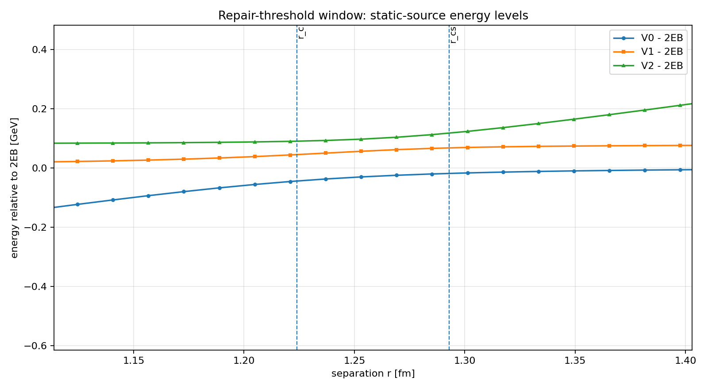
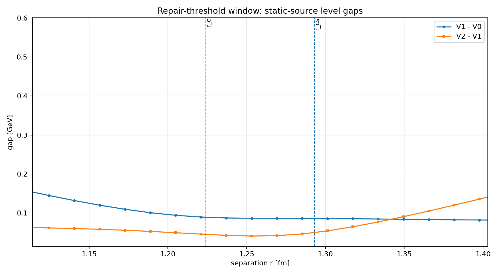
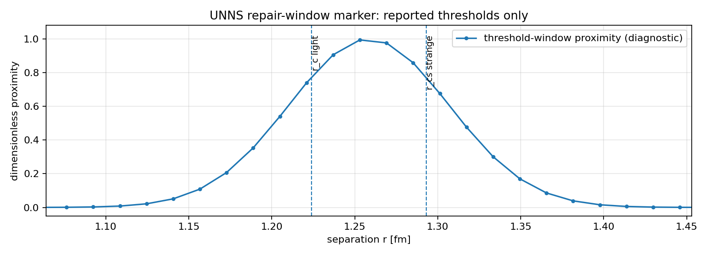

# UNNS Color Confinement - Repair Threshold Report

**Diagnostic:** Second Confinement Diagnostic  
**Subtitle:** Repair-threshold window around reported light and strange string-breaking markers  
**Project:** UNNS + Color Confinement Regime Synthesis  
**Status:** Formal diagnostic report; structural mapping, not a derivation of QCD confinement

---

## 1. Purpose

This report formalizes the second diagnostic of the UNNS + color confinement investigation. The goal is to isolate the threshold region where a stretched color route stops being treated merely as an increasing separation and becomes a channel-reorganization problem.

The diagnostic focuses only on:

```
r near r_c  ~= 1.224 fm
r near r_cs ~= 1.293 fm
gap behavior
two-meson threshold interpretation
transition from stretched route to repaired composite route
```

The extracted UNNS object is:

```
boundary-pressure proxy
-> repair-threshold marker
-> admissible composite route
```

---

## 2. Data boundary

The static-source levels used here are explicitly marked as:

```
MODEL_RECONSTRUCTION_FROM_REPORTED_PARAMETERS_NOT_RAW_DATA
```

They are useful for a controlled structural diagnostic, but they are not raw measured GEVP lattice points.

| Quantity | Value |
|---|---:|
| Static rows total | 57 |
| Static separation minimum | 0.70686 fm |
| Static separation maximum | 1.60650 fm |
| Rows inside threshold-analysis window | 17 |
| Minimum global V1-V0 gap | 0.07838 GeV at r = 1.60650 fm |
| Minimum global V2-V1 gap | 0.04092 GeV at r = 1.25307 fm |

Boundary statement:

> This diagnostic does not claim that UNNS derives QCD confinement. It converts the reported string-breaking region into a structured UNNS repair-window object.

---

## 3. Reported repair-threshold markers

| Symbol | Channel | Reported r [fm] | Nearest reconstructed r [fm] | V1-V0 [GeV] | V2-V1 [GeV] |
|---|---|---:|---:|---:|---:|
| r_c | light_static_light_threshold | 1.224 | 1.22094 | 0.08970 | 0.04594 |
| r_cs | strange_static_strange_threshold | 1.293 | 1.28520 | 0.08642 | 0.04639 |

The two reported thresholds are treated as repair-threshold markers, not as free-color externalization points.

---

## 4. Figures

### Figure 1. Repair-threshold energy-level window



### Figure 2. Repair-threshold static-source gap window



### Figure 3. UNNS repair-window marker



---

## 5. Diagnostic finding

The reconstructed spectrum places both reported string-breaking thresholds inside a region where the low-lying static-source gaps are compressed relative to the smaller-separation side. This makes the region suitable as the first UNNS repair-window object:

```
stretched color route
-> threshold-window approach
-> competing screened channel
-> repaired admissible color-neutral composite route
```

The relevant diagnostic is not simply that an energy rises. The relevant diagnostic is that the route-extension coordinate enters a channel-reorganization window where the forbidden output is not an isolated colored constituent but a screened or color-neutral composite channel.

---

## 6. UNNS object extracted

| Physics item | UNNS interpretation |
|---|---|
| separation r | route-extension coordinate |
| V0,V1,V2 static spectrum | boundary-pressure / route-tension spectrum |
| V1-V0 and V2-V1 gaps | channel-competition / repair-window indicators |
| r_c | light-channel repair-threshold marker |
| r_cs | strange-channel repair-threshold marker |
| screened two-meson channel | repaired admissible composite route |

---

## 7. Interpretation

The second diagnostic transforms the broad color-confinement statement into a more precise UNNS regime object. The system is not interpreted as moving from bound color to free external color. Instead, the route-extension coordinate approaches a repair window in which competing screened channels become the admissible continuation.

In UNNS terms, the threshold window is therefore not a failure of closure. It is a transition region where boundary pressure is redirected into repaired closure:

```
attempted external separation
-> route tension
-> repair-threshold window
-> screened/color-neutral composite continuation
```

This is the first formal threshold-local expression of color confinement as admissibility-by-closure.

---

## 8. What is supported

Supported by the current diagnostic:

- a concrete repair-threshold window around the reported light and strange string-breaking distances;
- a gap-based channel-competition diagnostic in that window;
- a clean UNNS mapping from route extension to threshold repair;
- preservation of the internal/external distinction: colored constituents remain internal coordinates, while external admissibility appears through color-neutral screened channels.

---

## 9. What is not yet supported

Not yet supported:

- a full measured-point analysis of V0(r), V1(r), V2(r);
- covariance/uncertainty propagation for the reconstructed spectrum;
- a fitted UNNS boundary-pressure law;
- a derivation of QCD confinement from UNNS.

---

## 10. Next required data/action

```
1. Obtain author or digitized measured V0,V1,V2 points around r_c and r_cs.
2. Extend Baker flux-tube profiles across separations approaching the onset of string breaking.
3. Build the first threshold-local boundary-pressure proxy only after measured/digitized static points are available.
```

The immediate next research question is:

> Does route localization, measured through the chromoelectric flux-tube profile, change systematically as the static-source separation approaches the repair-threshold window?

---

## 11. Files associated with this report

```
reports/02_repair_threshold_analysis.md
reports/02_repair_threshold_analysis_metrics.json
reports/repair_threshold_window_static_gaps.csv
reports/fig_repair_threshold_energy_levels_zoom.png
reports/fig_repair_threshold_gaps_zoom.png
reports/fig_repair_threshold_proximity_map.png
```
